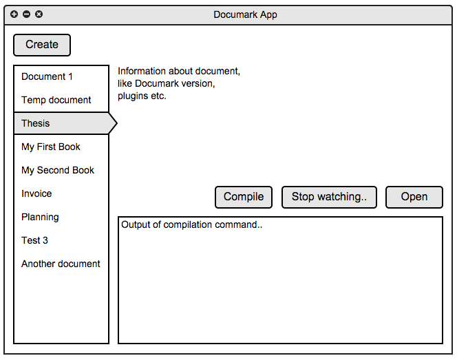

# Documark App

> Stand-alone application for creating and compiling documents with [Documark][documark].

#### Warning: Work in progress!

## Concept

A quick mockup of the idea:

As shown above the basic stuff of creating, compiling, and watching a project/document. Additionally:

1. When creating a document a picker can be shown with all available themes (`dmp-theme-`) and styles (`dmp-style-`).
2. Plugins should be automatically installed (write a plugin for this and always that one?).
3. The generated `document.jade` will contain a basic document layout (cover, header, footer, page numbering, toc, etc.), although this varies depending on the chosen theme or style.
4. The `Open` button will open the generated document in the default PDF viewer. This could also be a built in previewer (PDF.js?).
5. There should be some way of opening the document's directory to add assets, do version control, etc.

[documark]: https://www.npmjs.com/package/documark
